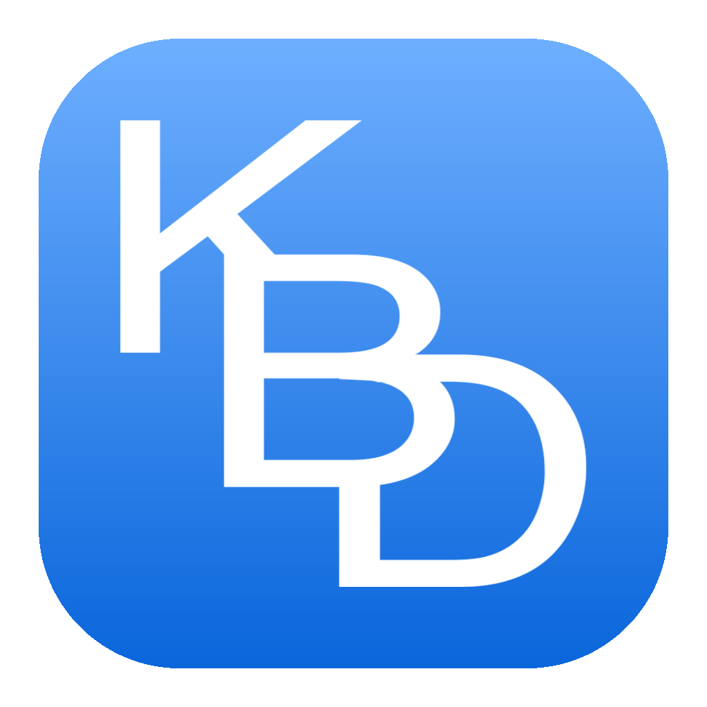

# KBD

A floating number pad for macOS that types into whatever text field you're
already working in — in any application.

Spreadsheets, scoring software, web forms, databases, your own tools: if it
accepts typing, it accepts KBD. There is nothing to configure per app and no
compatibility list, because the keys send genuine keyboard events rather than
pasting or scripting.

## What it does

- **Never takes your place.** KBD is a non-activating panel, so pressing a key
  does not make it the active app and does not move the cursor out of the
  field you're filling in. Your selection and insertion point stay exactly
  where they were.
- **Goes where you want it.** Drag from anywhere on the coloured field — the
  whole background is the handle. It floats above your windows, on every
  Space, including full-screen apps.
- **Sizes to suit.** Drag the corner grip, option-drag the field, or pick a
  size from the right-click menu. 60% to 300%, scaling as one piece.
- **Colours to suit.** Right-click for eight field colours. The labels adjust
  automatically so they stay readable on each.
- **Stays until dismissed.** It keeps working across app switches until you
  press DISMISS. Position, size and colour come back next launch.

## Install

Download the latest `.dmg` from [Releases](../../releases) and drag KBD to
your Applications folder. The app is signed with a Developer ID and notarized
by Apple, so it opens without any Gatekeeper warning.

Or with Homebrew:

    brew install --cask spurious-cox/tap/kbd

## Accessibility permission

macOS only lets an application send keystrokes to other applications once you
allow it. The first time you open KBD it asks, with a button that takes you
straight to the right settings pane:

**System Settings → Privacy & Security → Accessibility** — switch on KBD.

The keys start working as soon as you do; the keypad notices on its own and
there's no need to restart it. While the permission is missing, the credit bar
says `KBD — needs Accessibility` rather than failing silently, and
`Accessibility Permission…` on the right-click menu reopens that pane any
time.

This permission is what makes KBD work at all, and it's also why the app
cannot be distributed through the Mac App Store: store apps must be sandboxed,
and the sandbox exists precisely to prevent one app from typing into another.

## Building from source

Requires macOS 13 or later and Python 3 with a virtual environment:

    python3 -m venv venv
    ./venv/bin/python -m pip install pyobjc-core pyobjc-framework-Cocoa \
        pyobjc-framework-Quartz pyobjc-framework-ApplicationServices py2app Pillow
    ./venv/bin/python make_icon.py
    ./build.sh --install

`build.sh` signs every Mach-O in the bundle under the hardened runtime, which
`codesign --deep` does not do for a py2app bundle. `release.sh` notarizes the
app and the DMG and staples both; it expects a `notarytool` keychain profile.

To preview a layout change without launching anything:

    ./venv/bin/python render_test.py preview.png [colour-preset] [scale]

## Licence

MIT — see [LICENSE](LICENSE).
